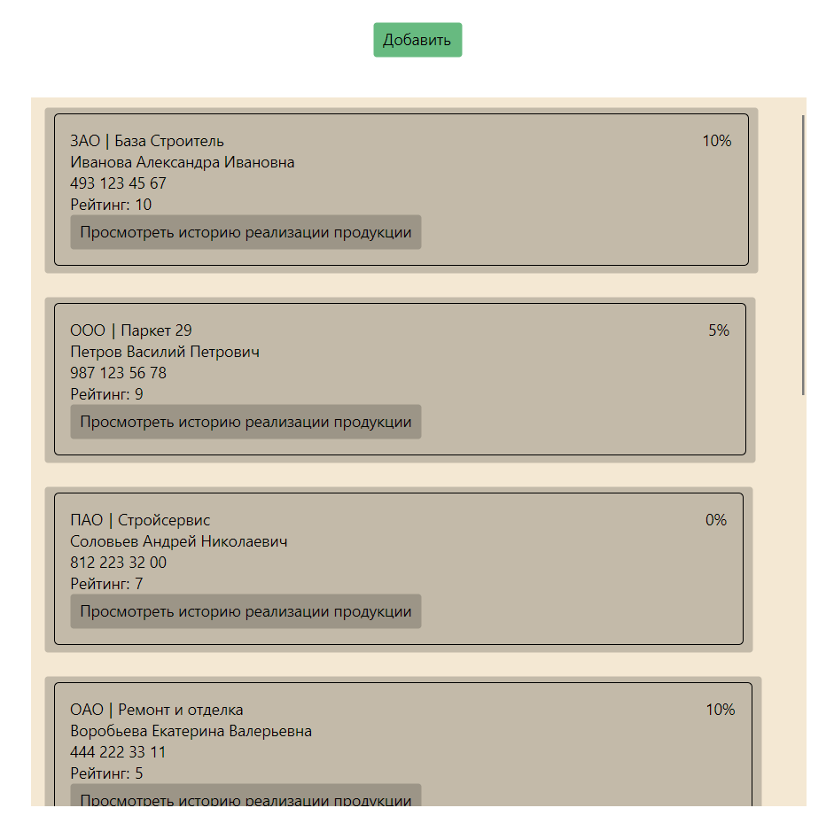
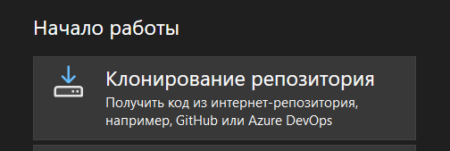

# Provalenko43P_UP

Данный проект разработан для управления партнерами компании "Мастер пол". Он 
позволяет просматривать список партнеров, редактировать существующие записи и
добавлять новых партнеров. Кроме того, пользователи могут отслеживать историю 
продаж продукции для каждого партнера.

## Начало работы

Эти инструкции предоставят вам копию проекта и помогут запустить на вашем локальном компьютере для разработки и тестирования.

### Необходимые условия

1. Установите интегрированную среду разработки (IDE), например, [VisualStudio](https://visualstudio.microsoft.com/ru/).
2. Для успешного запуска проекта скачайте все необходимые пакеты Avalonia на официальном сайте документации [Avalonia UI](https://docs.avaloniaui.net/docs/get-started/install).

### Установка

1. При открытии Visual Studio выберете "Клонирование репозитория".

2. Вставьте ссылку и нажмите клонировать.

## Авторы

* Проваленко Людмила - *Разработчик* - [Blueris](https://github.com/Blueriss).